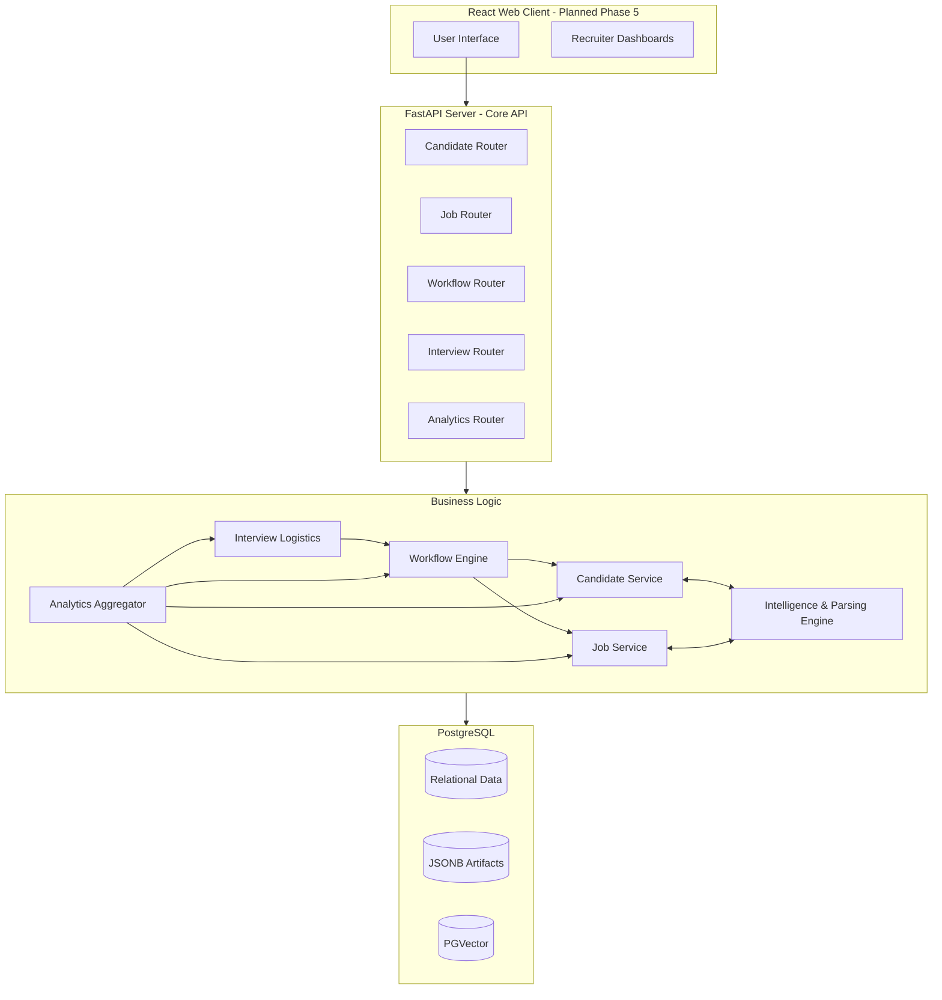
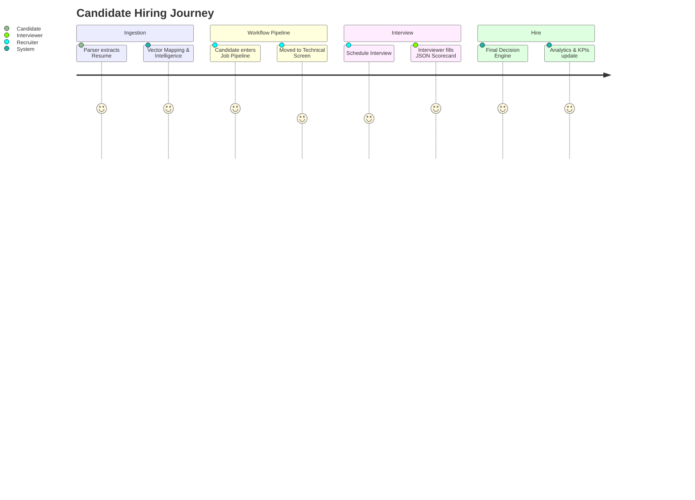
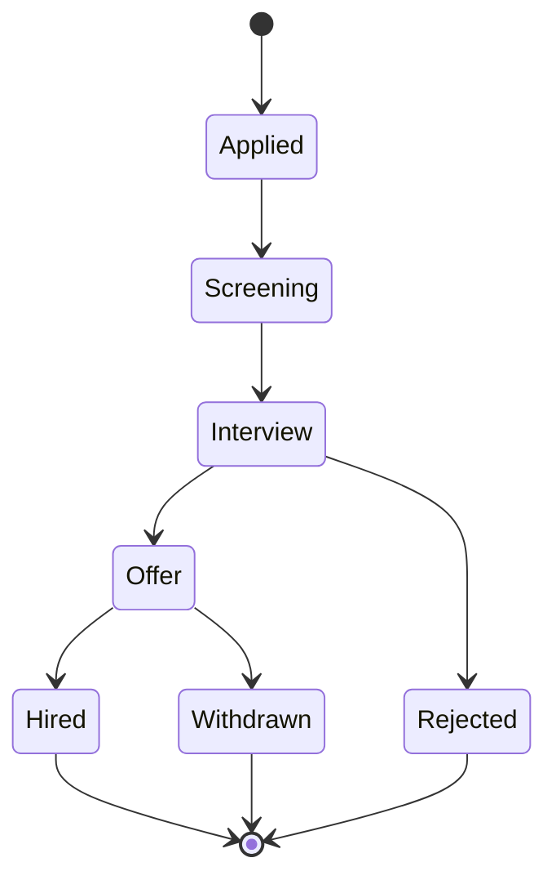
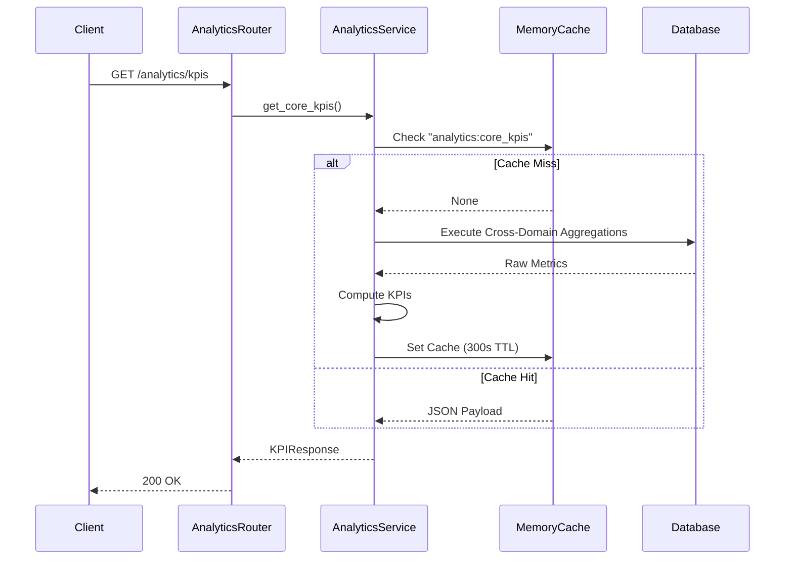
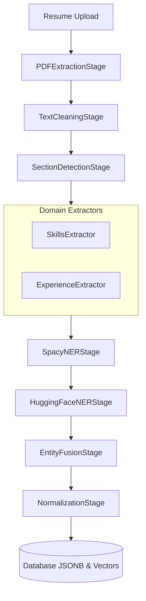

# Application Flow

## Revision History
| Date       | Version | Description                   |
| ---------- | ------- | ----------------------------- |
| 2026-07-23 | 2.5     | Updated to reflect Phase 3 Domain Architecture |

## 1. Overall System Architecture

## 2. Core Object Lifecycle

## 3. Workflow Engine State Transitions

## 4. Analytics Aggregation Flow

## 5. Document Processing Pipeline (Intelligence Core)

