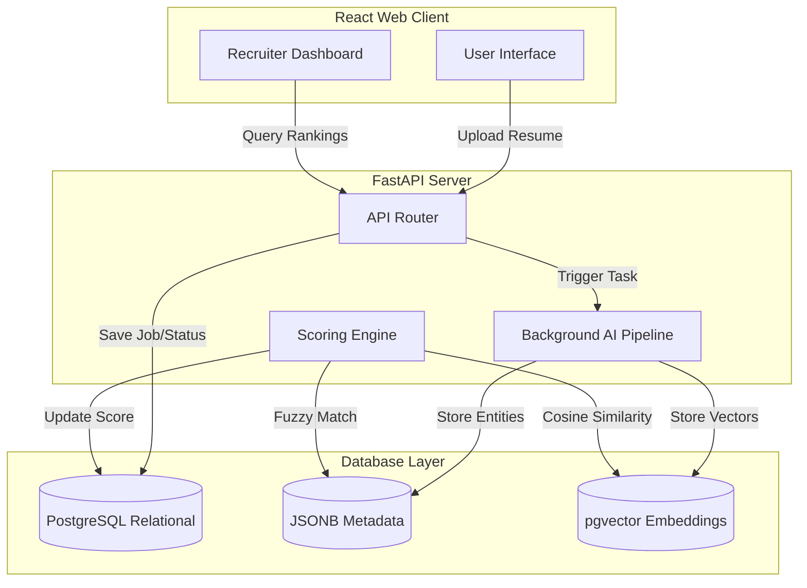
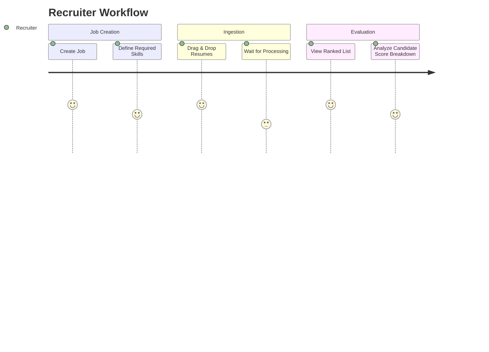
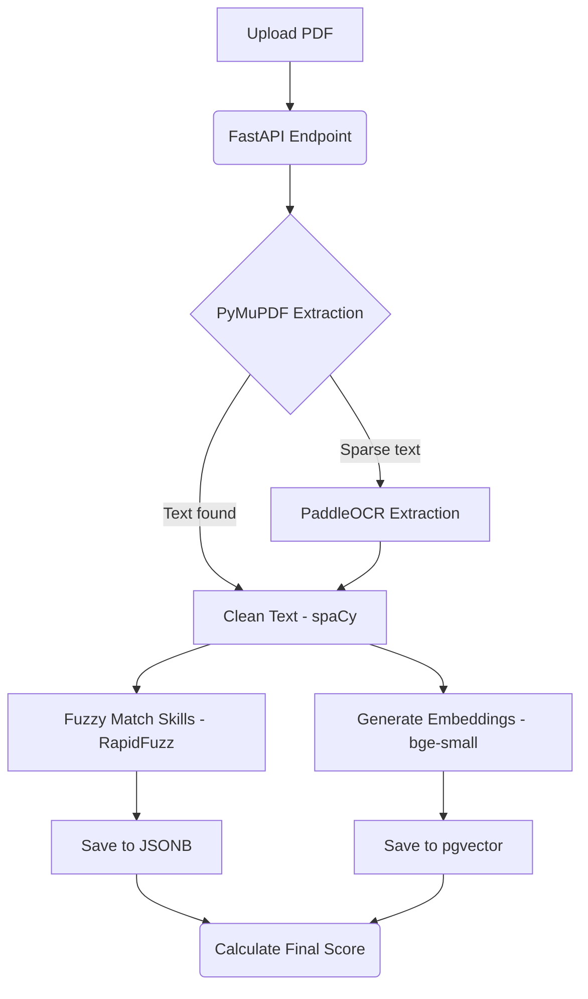
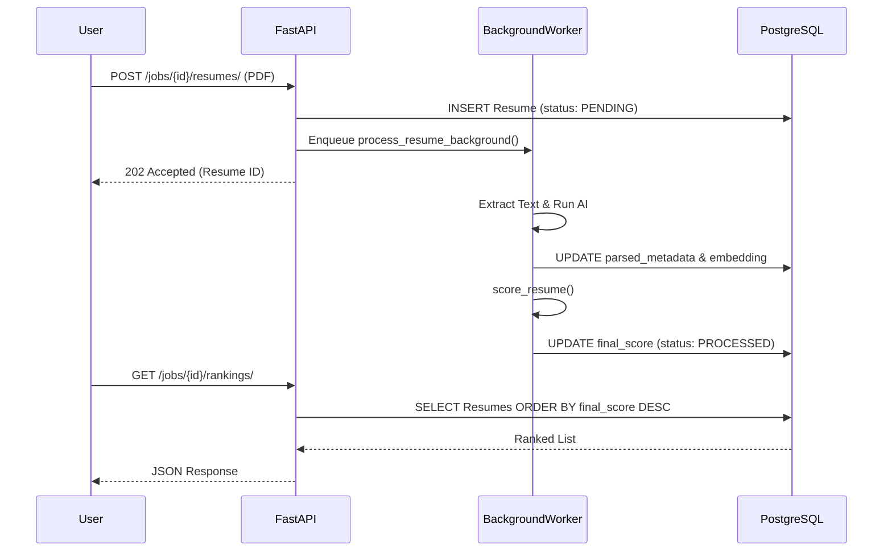

# Application Flow

## Revision History
| Date       | Version | Description                   |
| ---------- | ------- | ----------------------------- |
| 2026-07-23 | 1.0     | Initial MVP Document Creation |

## 1. Overall System Architecture

## 2. User Journey

## 3. Document Processing Pipeline

## 4. Request Lifecycle

