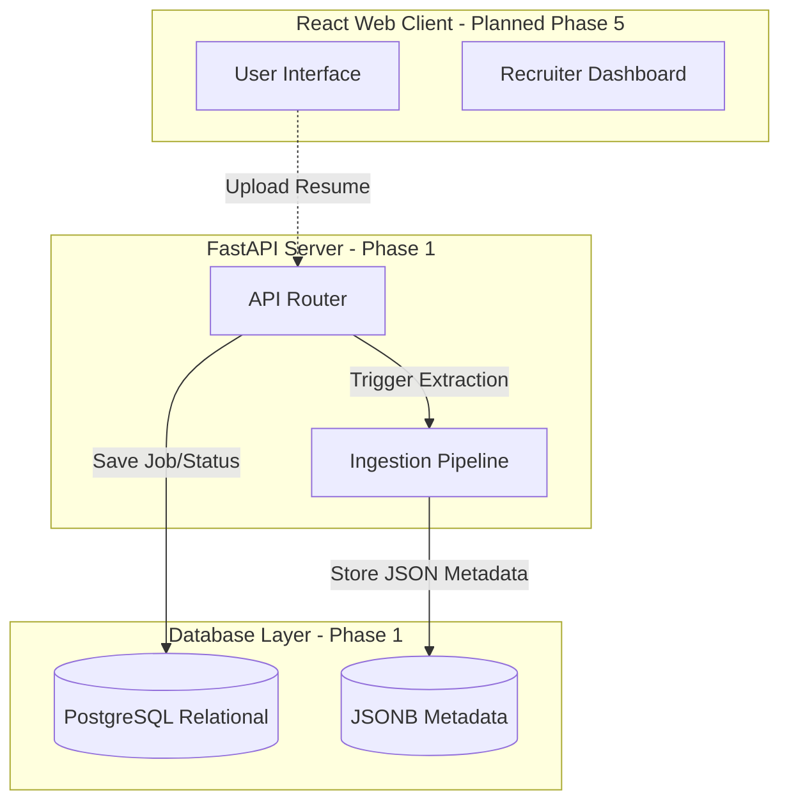
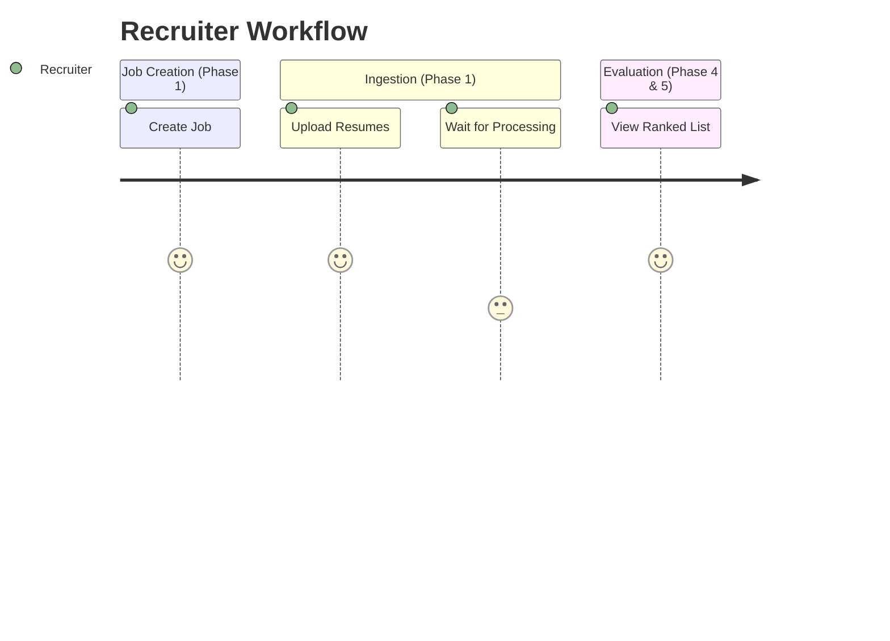
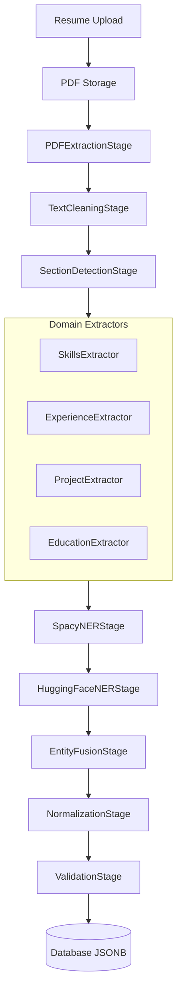
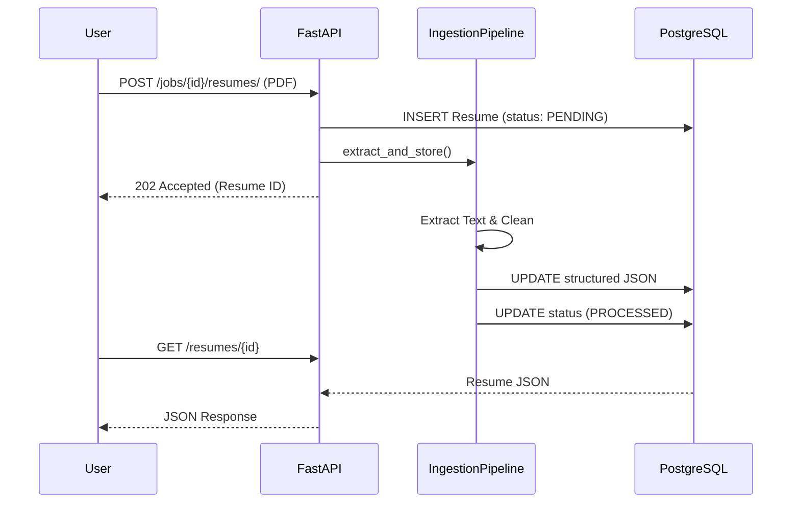

# Application Flow

## Revision History
| Date       | Version | Description                   |
| ---------- | ------- | ----------------------------- |
| 2026-07-23 | 1.1     | Updated to reflect Phase 1 Architecture |
| 2026-07-23 | 2.2     | Updated to reflect Phase 2.2 Hybrid Pipeline |

## 1. Overall System Architecture

## 2. User Journey

## 3. Document Processing Pipeline (Phase 2.2.1)

## 4. Request Lifecycle (Phase 1)

