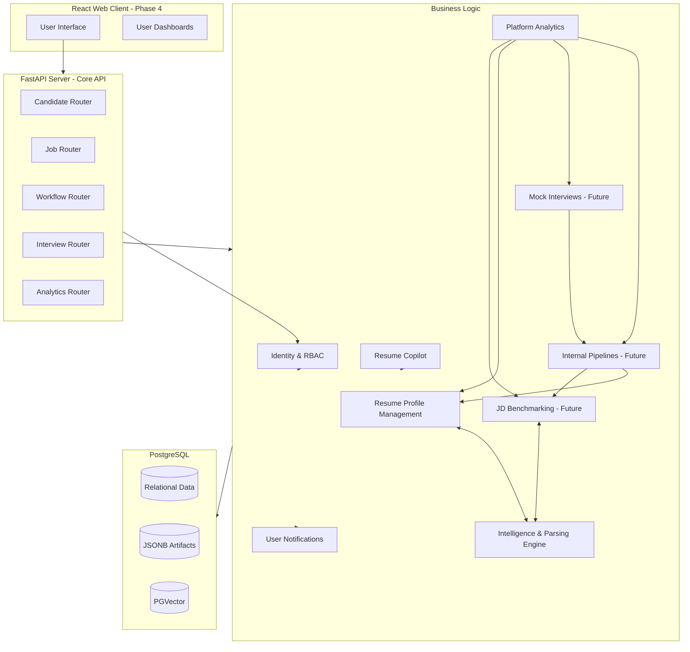
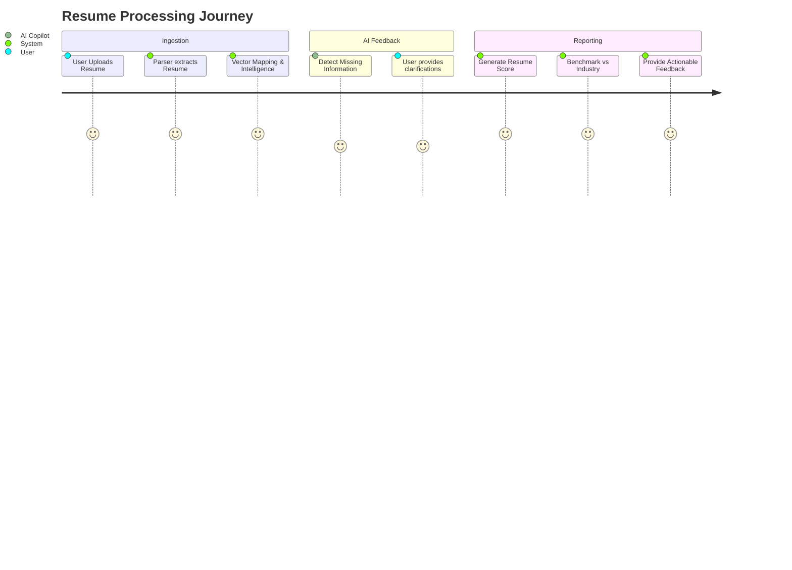
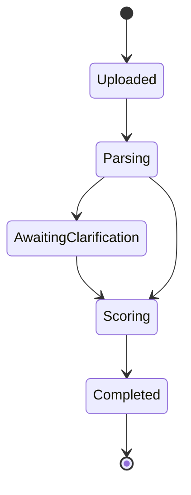
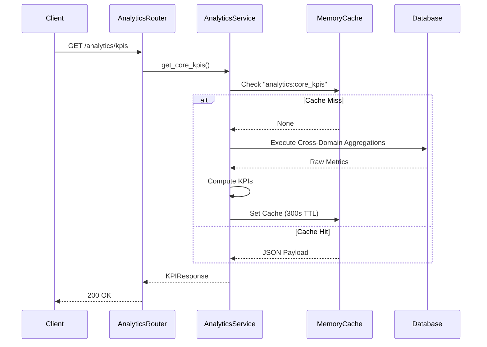
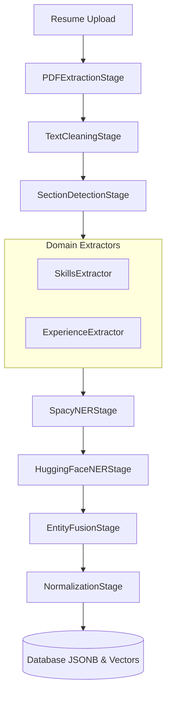

# Application Flow

## Revision History
| Date       | Version | Description                   |
| ---------- | ------- | ----------------------------- |
| 2026-07-23 | 2.5     | Updated to reflect Phase 3 Domain Architecture |
| 2026-07-26 | 3.0     | Updated for Resume Intelligence Platform |

## 1. Overall System Architecture

```mermaid
graph TD
    subgraph Frontend [React Web Client - Phase 4]
        UI[User Interface]
        Dash[User Dashboards]
    end

    subgraph API [FastAPI Server - Core API]
        R1[Candidate Router]
        R2[Job Router]
        R3[Workflow Router]
        R4[Interview Router]
        R5[Analytics Router]
    end

    subgraph Domains [Business Logic]
        C[Resume Profile Management]
        J[JD Benchmarking - Future]
        W[Internal Pipelines - Future]
        I[Mock Interviews - Future]
        A[Platform Analytics]
        INT[Intelligence & Parsing Engine]
        ID[Identity & RBAC]
        COM[User Notifications]
        AI[Resume Copilot]
    end

    subgraph Database [PostgreSQL]
        PG[(Relational Data)]
        JS[(JSONB Artifacts)]
        VEC[(PGVector)]
    end

    UI --> API
    API --> ID
    API --> Domains
    Domains --> Database
    C & J <--> INT
    W --> C & J
    I --> W
    A --> W & I & C & J
    ID -.-> Domains
    Domains -.-> COM
    AI -.-> Domains
```

## 2. Core Object Lifecycle

```mermaid
journey
    title Resume Processing Journey
    section Ingestion
      User Uploads Resume: 5: User
      Parser extracts Resume: 5: System
      Vector Mapping & Intelligence: 5: System
    section AI Feedback
      Detect Missing Information: 4: AI Copilot
      User provides clarifications: 4: User
    section Reporting
      Generate Resume Score: 5: System
      Benchmark vs Industry: 5: System
      Provide Actionable Feedback: 5: System
```

## 3. Resume Processing State Transitions

```mermaid
stateDiagram-v2
    [*] --> Uploaded
    Uploaded --> Parsing
    Parsing --> AwaitingClarification
    AwaitingClarification --> Scoring
    Parsing --> Scoring
    Scoring --> Completed
    Completed --> [*]
```

## 4. Analytics Aggregation Flow

```mermaid
sequenceDiagram
    participant Client
    participant AnalyticsRouter
    participant AnalyticsService
    participant MemoryCache
    participant Database

    Client->>AnalyticsRouter: GET /analytics/kpis
    AnalyticsRouter->>AnalyticsService: get_core_kpis()
    AnalyticsService->>MemoryCache: Check "analytics:core_kpis"
    
    alt Cache Miss
        MemoryCache-->>AnalyticsService: None
        AnalyticsService->>Database: Execute Cross-Domain Aggregations
        Database-->>AnalyticsService: Raw Metrics
        AnalyticsService->>AnalyticsService: Compute KPIs
        AnalyticsService->>MemoryCache: Set Cache (300s TTL)
    else Cache Hit
        MemoryCache-->>AnalyticsService: JSON Payload
    end
    
    AnalyticsService-->>AnalyticsRouter: KPIResponse
    AnalyticsRouter-->>Client: 200 OK
```

## 5. Document Processing Pipeline (Intelligence Core)

```mermaid
flowchart TD
    A[Resume Upload] --> B[PDFExtractionStage]
    B --> C[TextCleaningStage]
    C --> D[SectionDetectionStage]
    
    subgraph EntityExtractionStage [Domain Extractors]
        F1[SkillsExtractor]
        F2[ExperienceExtractor]
    end
    
    D --> EntityExtractionStage
    EntityExtractionStage --> G[SpacyNERStage]
    G --> H[HuggingFaceNERStage]
    H --> I[EntityFusionStage]
    I --> J[NormalizationStage]
    J --> K[(Database JSONB & Vectors)]
```
