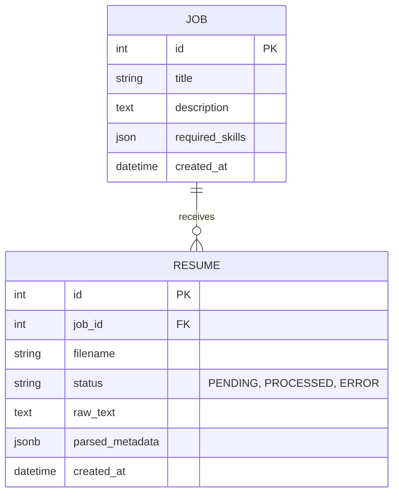
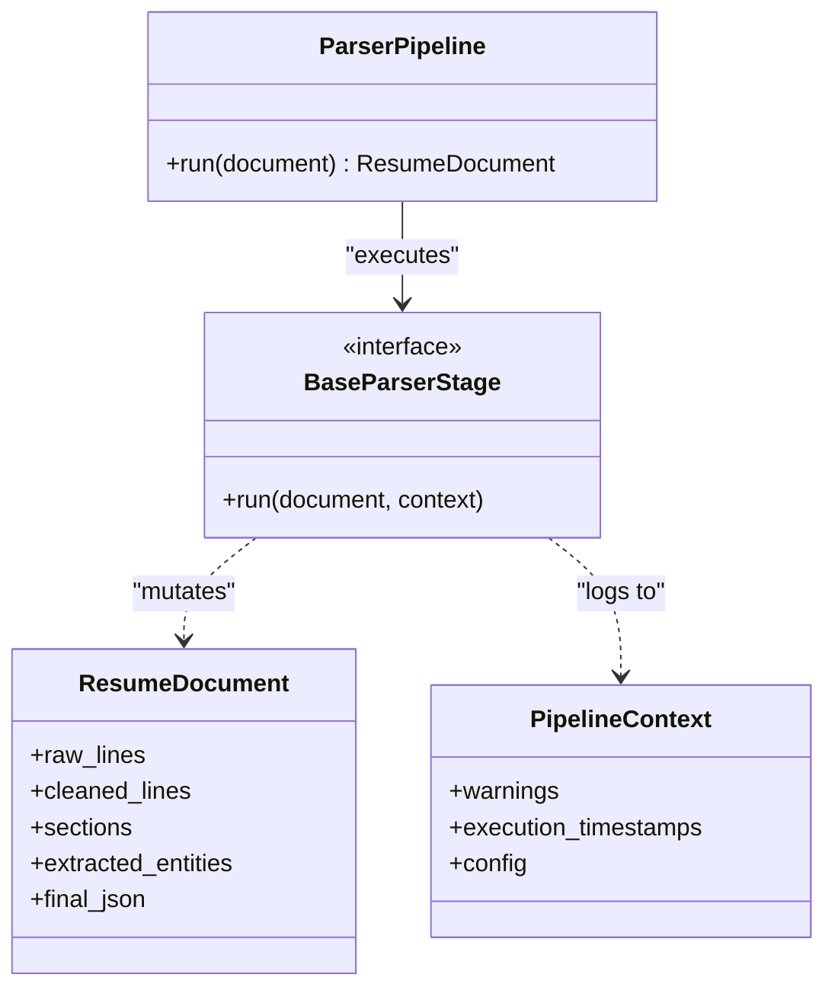

# Backend Schema & Architecture

## Revision History
| Date       | Version | Description                   |
| ---------- | ------- | ----------------------------- |
| 2026-07-23 | 1.1     | Updated folder structure and removed AI for Phase 1 |

## 1. Folder Structure
```text
/backend
├── app/
│   ├── api/             # HTTP endpoints and routing
│   ├── core/            # Config, DB connection
│   ├── database/        # Database session management
│   ├── models/          # SQLAlchemy table definitions
│   ├── schemas/         # Pydantic data validation (Request/Response)
│   ├── services/        # Business logic orchestration
│   ├── parsers/         # Document Processing Engine
│   │   ├── core/        # Pipeline orchestration and models
│   │   └── stages/      # OOP parser stages (Extraction, Cleaning, etc.)
│   ├── storage/         # Local file storage handlers
│   └── utils/           # Helper functions
├── config/              # YAML rules and regex definitions
└── development/         # Benchmarking and Sandbox tools
```
*(Note: The `ai/` directory will be introduced in Phase 3)*

## 2. Entity Relationships (ER Diagram)

*(Note: Embeddings and Vector tables will be introduced in Phase 3. Scores will be added in Phase 4.)*

## 3. Database Tables
- **jobs**: Stores the target job requirements.
- **resumes**: Uses a flexible `JSONB` column (`parsed_metadata`) to avoid complex relational joins for dynamic data like skills and education.

## 4. Parser Architecture (Phase 1D)
The backend utilizes an Object-Oriented pipeline for document processing.



## 5. API Modules
- `POST /jobs/`: Create a new job requirement.
- `GET /jobs/`: Retrieve all active jobs.
- `POST /jobs/{id}/resumes/`: Upload a resume document for a job.
- `GET /resumes/{id}`: Retrieve parsed resume JSON.

## 5. Storage
- **Relational**: PostgreSQL.
- **Documents**: Uploaded PDFs are temporarily stored on local disk (`/uploads`) until processed.
