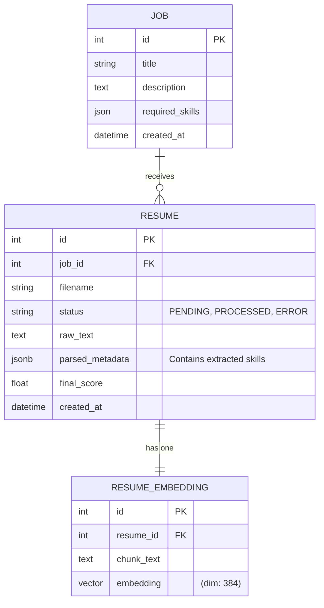
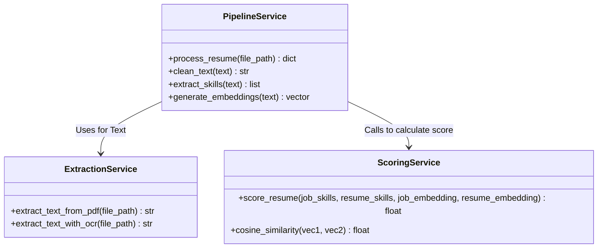

# Backend Schema & Architecture

## Revision History
| Date       | Version | Description                   |
| ---------- | ------- | ----------------------------- |
| 2026-07-23 | 1.0     | Initial MVP Document Creation |

## 1. Folder Structure
```text
/backend
├── app/
│   ├── api/             # HTTP endpoints and routing
│   ├── core/            # Config, DB connection, Skills dictionary
│   ├── models/          # SQLAlchemy table definitions
│   ├── schemas/         # Pydantic data validation (Request/Response)
│   ├── services/        # Business logic, OCR, NLP pipelines
│   └── main.py          # FastAPI application entry point
```

## 2. Entity Relationships (ER Diagram)


## 3. Database Tables
- **jobs**: Stores the target job requirements.
- **resumes**: Uses a flexible `JSONB` column (`parsed_metadata`) to avoid complex relational joins for dynamic data like skills and education.
- **resume_embeddings**: Uses the `pgvector` extension. A `VECTOR` type is used to execute native cosine similarity searches inside the DB.

## 4. API Modules
- `POST /jobs/`: Create a new job requirement.
- `GET /jobs/`: Retrieve all active jobs.
- `POST /jobs/{id}/resumes/`: Upload a resume document for a job.
- `GET /jobs/{id}/rankings/`: Retrieve a sorted list of scored candidates.

## 5. AI Modules & Services


## 6. Storage
- **Relational**: PostgreSQL.
- **Documents**: Uploaded PDFs are temporarily stored on local disk (`/uploads`) until processed.
- **Models**: Hugging Face models are cached natively in `~/.cache/huggingface` by default.
