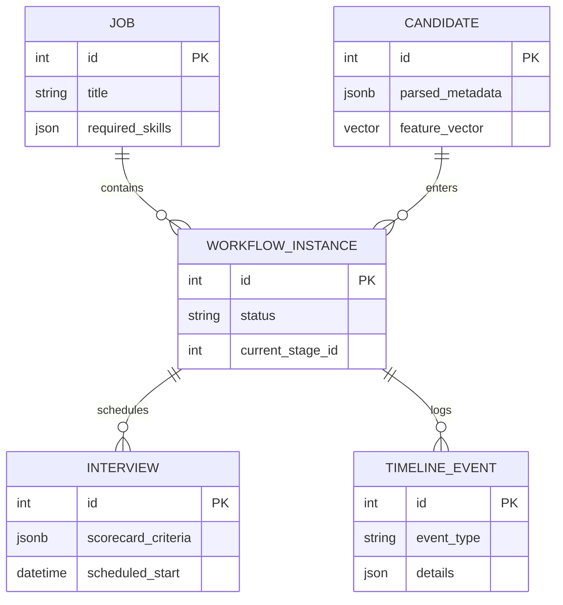

# Backend Schema & Architecture

## Revision History
| Date       | Version | Description                   |
| ---------- | ------- | ----------------------------- |
| 2026-07-23 | 2.5     | Updated schema for Phase 3 ATS Completion |

## 1. Folder Structure
```text
/backend
├── app/
│   ├── analytics/       # Aggregations, KPIs, CSV Exports
│   ├── candidate/       # Candidate Models & Logic
│   ├── intelligence/    # Intelligence Core (Matching, Scoring, Gap Analysis)
│   ├── interview/       # Scheduling, Panels, & Scorecards
│   ├── job/             # Job Models & Logic
│   ├── search/          # Candidate & Job Retrieval Engine
│   ├── workflow/        # Configurable Pipelines & Timeline Events
│   ├── workspace/       # Caching, Dashboards, & Notifications
│   ├── parsers/         # Document Processing Engine
│   ├── models/          # Shared SQLAlchemy Base & Enums
│   └── main.py          # FastAPI Entrypoint
├── config/              # YAML rules (Workflow Pipelines, Parser Logic)
└── parser_tests/        # Comprehensive PyTest Integration Suite
```

## 2. Entity Relationships (ER Diagram)


## 3. Database Tables
- **candidates / jobs**: Foundational models utilizing `JSONB` metadata and `VECTOR` types for semantic search.
- **workflow_instances**: The connective tissue linking Candidates to Jobs via configurable pipelines.
- **interviews**: Manage scheduling and customized `JSONB` scorecards.
- **dashboard_configs / saved_reports**: Analytics tables persisting JSON dashboard layouts and user-specific report filters.

## 4. Cross-Domain Operations
The backend utilizes strict Domain-Driven Design (DDD). 
- To avoid tight coupling, domains broadcast state changes using the `TimelineService` (part of Workflow).
- When a Candidate is hired, an event is logged in the timeline, which can asynchronously trigger caching updates in the `Workspace` or recalculations in `Analytics`.

## 5. API Modules
- `/candidates/*`: CRUD and parsing for resumes.
- `/jobs/*`: CRUD for roles.
- `/workflow/*`: Pipeline transitions, approvals, assignments.
- `/interviews/*`: Scheduling, panels, feedback execution.
- `/workspace/*`: Cached notifications, activities, dashboard feeds.
- `/analytics/*`: Csv reports, KPIs, time-series trends.

## 6. Storage & Caching
- **Relational**: PostgreSQL.
- **Vectors**: `pgvector`.
- **Caching**: `MemoryCacheRepository` abstracts the caching interface for rapid analytics delivery. (Easily swappable with Redis for multi-node deployments).
