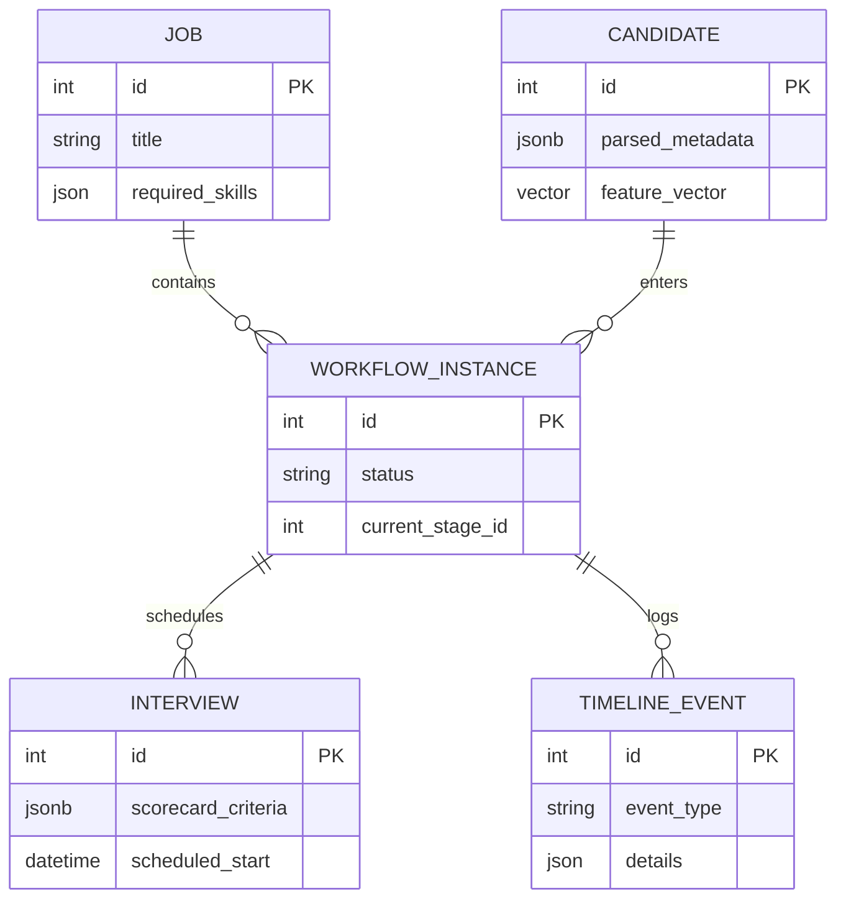

# Backend Schema & Architecture

## Revision History
| Date       | Version | Description                   |
| ---------- | ------- | ----------------------------- |
| 2026-07-23 | 2.5     | Updated schema for Phase 3 ATS Completion |
| 2026-07-26 | 3.0     | Updated context for Resume Intelligence Platform |

## 1. Folder Structure
```text
/backend
├── app/
│   ├── analytics/       # Platform Engagement Analytics
│   ├── candidate/       # Resume Profile Management Models & Logic
│   ├── intelligence/    # Intelligence Core (Matching, Scoring, Gap Analysis)
│   ├── interview/       # Future Mock Interview Platform (Scheduling, Panels)
│   ├── job/             # Job Description Benchmarking Models & Logic
│   ├── search/          # Resume Benchmarking & Ranking Engine
│   ├── workflow/        # Internal Processing Pipelines
│   ├── workspace/       # Caching, User Dashboards, & Feeds
│   ├── identity/        # Users, Organizations, Auth, RBAC
│   ├── communication/   # User Notification Hub
│   ├── ai/              # AI Feedback, Copilot, Memory, Prompts
│   ├── parsers/         # Document Processing Engine
│   ├── models/          # Shared SQLAlchemy Base & Enums
│   └── main.py          # FastAPI Entrypoint
├── config/              # YAML rules
└── parser_tests/        # Comprehensive PyTest Integration Suite
```

## 2. Entity Relationships (ER Diagram)
*Note: The core schema was originally built to support an ATS. While the product vision is now a B2C Resume Intelligence Platform, the robust underlying schema (including Workflows, Jobs, and Interviews) remains intact to support complex future features like Job Benchmarking and Mock Interviews.*


```mermaid
erDiagram
    JOB ||--o{ WORKFLOW_INSTANCE : "contains"
    CANDIDATE ||--o{ WORKFLOW_INSTANCE : "enters"
    WORKFLOW_INSTANCE ||--o{ INTERVIEW : "schedules"
    WORKFLOW_INSTANCE ||--o{ TIMELINE_EVENT : "logs"

    JOB {
        int id PK
        string title
        json required_skills
    }

    CANDIDATE {
        int id PK
        jsonb parsed_metadata
        vector feature_vector
    }
    
    WORKFLOW_INSTANCE {
        int id PK
        string status
        int current_stage_id
    }
    
    INTERVIEW {
        int id PK
        jsonb scorecard_criteria
        datetime scheduled_start
    }
    
    TIMELINE_EVENT {
        int id PK
        string event_type
        json details
    }
```

## 3. Database Tables
- **candidates / jobs**: Foundational models utilizing `JSONB` metadata and `VECTOR` types for semantic search. `candidates` tracks user resume profiles, while `jobs` tracks benchmark targets.
- **workflow_instances**: The connective tissue linking user profiles to processing states via configurable pipelines.
- **interviews**: Preserved for future mock interview scheduling and customized `JSONB` scorecards.
- **dashboard_configs / saved_reports**: Analytics tables persisting JSON dashboard layouts and user-specific report filters.

## 4. Cross-Domain Operations
The backend utilizes strict Domain-Driven Design (DDD). 
- To avoid tight coupling, domains broadcast state changes using the `TimelineService` (part of Workflow).
- When a resume profile finishes processing, an event is logged in the timeline, which can asynchronously trigger caching updates in the `Workspace` or recalculations in `Analytics`.

## 5. API Modules
- `/candidates/*`: CRUD and parsing for user resumes.
- `/jobs/*`: CRUD for job benchmark roles.
- `/workflow/*`: Pipeline transitions, internal processing states.
- `/interviews/*`: Preserved for future mock interviews.
- `/workspace/*`: Cached notifications, activities, user dashboard feeds.
- `/analytics/*`: Platform KPIs, engagement trends.
- `/identity/*`: Auth, Organizations, Users, Roles, Auditing.
- `/communication/*`: Message Hub, Notifications, Templates.
- `/ai/*`: Copilot AI Feedback, Trace Observability.

## 6. Storage & Caching
- **Relational**: PostgreSQL.
- **Vectors**: `pgvector`.
- **Caching**: `MemoryCacheRepository` abstracts the caching interface for rapid analytics delivery. (Easily swappable with Redis for multi-node deployments).
